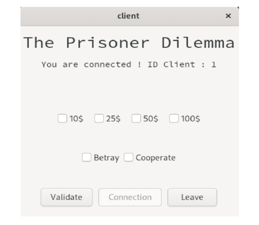

# Le dilemme du prisonnier

## Dépendances
Le projet du dilemme du prisonnier repose sur le système **Linux** ainsi que sur **plusieurs bibliothèques**. Il faut alors préinstaller :

 - [Libconfig](https://hyperrealm.github.io/libconfig/libconfig_manual.pdf) (Support de configuration) : 
	- Fedora : `sudo yum install libconfig-devel`
	-  Ubuntu : `sudo apt install libconfig-dev`
 - [GTK](https://www.gtk.org/docs/installations/linux/) (Interface graphique)
	 - Fedora : `sudo dnf install gtk3-devel`
 - [Doxygen](https://www.doxygen.nl/index.html) (Documentation technique)
	 - Fedora : `sudo yum install doxygen`
	 - Ubuntu : `sudo apt install doxygen`

## Installation

 1. Clonage du dépot `git clone https://www.github.com/hbourget/ThePrisoner`
 2. Se rendre dans le dossier racine `cd ThePrisoner`
 3. Générer les exécutables `make all`, `make client`, `make server`
 4. Génération de la documentation `make documentation`
 5. Lancement des exécutables depuis la racine `./build/client`, `./build/server`

## Interface
Les usagers jouent l’un contre l’autre, un nombre de fois à définir, sans jamais savoir qui sont leurs adversaires. On définira une partie comme étant un certain nombre de manches. Une manche est définie comme une confrontation trahison-collaboration entre les deux volontaires avec des mises.



## Configuration

Il est possible de configurer à souhait le programme. Les fichiers à modifier sont :

 - `cfg/client.config`

```
serverIP = "0.0.0.0"; #IP du serveur auquel le client va se connecter
serverPort = 7799; #Port du serveur auquel le client va se connecter
idClient = 1; #ID du client (nombre entier uniquement)
```

- `cfg/server.config`

```
serverIP = "0.0.0.0"; #IP du serveur
serverPort = 7799; #Port du serveur
rooms = #Nombre de rooms illimités, il suffit de copier/coller les structures ci-dessous.
(
  {
    name = "Cyan"; #Nom de la room
    bank = 1000; #Balance initiale des deux volontaires
    nbRounds = 3; #Nombre de manches
    idClient_1 = 1; #ID du premier client de la room
    idClient_2 = 2; #ID du second client de la room
  },
  {
    name = "Magenta";
    bank = 500;
    nbRounds = 5;
    idClient_1 = 3;
    idClient_2 = 4;
  }
);
```

## Documentation Doxygen
Il est possible de générer la documentation technique de ce projet avec [Doxygen](https://www.doxygen.nl/index.html) en suivant le protocole suivant :

  * Installation de Doxygen  ``apt install doxygen`` / `dnf install doxygen`
  * Génération de la documentation  ``make documentation``

La documentation est généré sous format HTML. Pour la lire, il suffit d'ouvrir le fichier ``index.html`` situer dans le dossier **documentation** qui vient d'être créé à la racine du projet.

## Protocole d'utilisation

Pour que le projet fonctionne de manière optimale, il faut suivre le protocole suivant :

 - Dans un premier temps, chaque client doit cliquer sur le bouton `Connection` sans avoir cliquer sur une mise ou une action.
 - Pour la première manche, le premier client qui s'est connecter doit jouer (appuyer sur `Validate`) en premier. 
 - Bien prendre le temps, si on change de mise ou d'action, de décocher les cases antérieurs avant de cocher les nouvelles.
 - Si jamais le label de résultats ne s'affiche pas pour un client, ne pas hésiter à re-appuyer sur `Validate`.

> **Rappel**
> Le fichier de résultats est écrasé à chaque lancement du serveur. Il faut donc bien penser à sauvegarder ce dernier avant de redémarrer le serveur.
